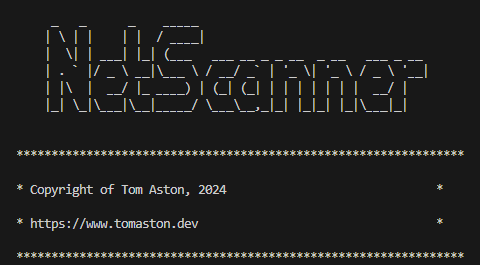

[![Contributors][contributors-shield]][contributors-url]
[![Forks][forks-shield]][forks-url]
[![Stargazers][stars-shield]][stars-url]
[![Issues][issues-shield]][issues-url]
[![MIT License][license-shield]][license-url]
[![LinkedIn][linkedin-shield]][linkedin-url]

# 🤖 NetScanner

The goal of NetScanner is to create an all-in-one CLI tool for exploring network vulnerabilities. The tool will utilise NMAP amongst other libraries to conduct a series of vulnerability tests to help improve Cybersecurity Engineer workflow.



Functionality will include host discovery, port scanning, os detection, and a software vulnerability assessment. An automated report for the network will be produced as a result.


## 🧑‍💻 Tech Stack

![Python]

## ⚙️ Features

### Active Host Discovery
Find active hosts on the network, with the help of NMAP under the hood, by specifying the port range to scan when prompted in the CLI.

Example port range syntax:

```192.168.1.1/24``` specifies a scan of all ports between 192.168.1.1 and 192.168.1.254 (corresponding to a subnet mast of 255.255.255.0)

```192.168.1.1``` specifies a scan of a single port i.e. 192.168.1.1

### CPE Matching

Find official CPE (Common Platform Enumeration) names and matches on the NVD (National Vulnerabiluity) database based on CPE's identified in the host scan.

Current CPE naming version is CPE 2.3

```cpe:<cpe_version>:<part>:<vendor>:<product>:<version>:<update>:<edition>:<language>:<sw_edition>:<target_sw>:<target_hw>:<other>```

### CVE Finder

Find CVEs (Common Vulnerabilities and Exposures) from the NVD (National Vulnerabiluity) database based on CPE names identified in the host scan.

### Automated Reporting

An optional automated CSV report is generated for the user on cleation of a host and vulnerability scan. The intent is to improve Cybersecuirty Engineer workflow by automating
repetitive vulnerability assessments on LANs or a group of IPs.

## 🔧 Setup

### Dependencies
``` pip install -r requirements.txt``` will install all dependcies required

### API Key
Request an API Key from https://nvd.nist.gov/developers/request-an-api-key and place it in your ```.env``` file as 'NVD_API_KEY'

### Run Locally
``` python ./main.py``` will run the CLI tool locally

## 🧑‍🤝‍🧑 Developers 

| Name           | Email                      |
| -------------- | -------------------------- |
| Tom Aston      | mailto:mail@tomaston.dev     |

<!-- MARKDOWN LINKS & IMAGES -->
<!-- https://www.markdownguide.org/basic-syntax/#reference-style-links -->
[contributors-shield]: https://img.shields.io/github/contributors/TomAston1996/net-scanner.svg?style=for-the-badge
[contributors-url]: https://github.com/TomAston1996/net-scanner/graphs/contributors
[forks-shield]: https://img.shields.io/github/forks/TomAston1996/net-scanner.svg?style=for-the-badge
[forks-url]: https://github.com/TomAston1996/net-scanner/network/members
[stars-shield]: https://img.shields.io/github/stars/TomAston1996/net-scanner.svg?style=for-the-badge
[stars-url]: https://github.com/TomAston1996/net-scanner/stargazers
[issues-shield]: https://img.shields.io/github/issues/TomAston1996/net-scanner.svg?style=for-the-badge
[issues-url]: https://github.com/TomAston1996/net-scanner/issues
[license-shield]: https://img.shields.io/github/license/TomAston1996/net-scanner.svg?style=for-the-badge
[license-url]: https://github.com/TomAston1996/net-scanner/blob/master/LICENSE.txt
[linkedin-shield]: https://img.shields.io/badge/-LinkedIn-black.svg?style=for-the-badge&logo=linkedin&colorB=555
[linkedin-url]: https://linkedin.com/in/tomaston96
[React.js]: https://img.shields.io/badge/React-20232A?style=for-the-badge&logo=react&logoColor=61DAFB
[React-url]: https://reactjs.org/
[TypeScript]: https://img.shields.io/badge/typescript-%23007ACC.svg?style=for-the-badge&logo=typescript&logoColor=white
[Redux]: https://img.shields.io/badge/redux-%23593d88.svg?style=for-the-badge&logo=redux&logoColor=white
[Chart.js]: https://img.shields.io/badge/chart.js-F5788D.svg?style=for-the-badge&logo=chart.js&logoColor=white
[Bootstrap]: https://img.shields.io/badge/bootstrap-%238511FA.svg?style=for-the-badge&logo=bootstrap&logoColor=white
[NodeJS]: https://img.shields.io/badge/node.js-6DA55F?style=for-the-badge&logo=node.js&logoColor=white
[Python]: https://img.shields.io/badge/python-3670A0?style=for-the-badge&logo=python&logoColor=ffdd54
